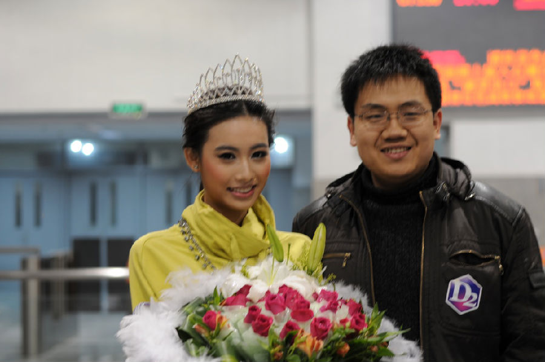

这次先给大家看个美女。这个美女是我某次参加 D2 前端峰会之后，在回上海的火车站上遇见的。当时在酒店正在举办一个比基尼小姐的选美比赛，没想到在火车站遇到了这次比赛的冠军。

于是我就扑了上去，合了个影。

没有把 D2 的贴纸撕掉真是个败笔。

言归正传，话说微信公众账号似乎还是挺好玩的。我稍微整理了一下自动回复，就跟搭了个客服一般，连我自己都玩的不亦乐乎。您可以回复 cmd 查看目前的一些选项。

我简单了解了一下，似乎目前技术相关的个人公众账号并不多，大都是些组织在维护，看来我来搞搞还是有机会可以出彩的。现在的首要任务还是希望可以吸引更多读者，过去几天发生了点喜闻乐见的事情，于是关注者暴涨了 1000 多，简直是人类的希望。不过这种好事没法长久，于是我就想举办一些活动来刺激一下。

目前除了“有奖征答”栏目以外，我还打算搞个“快速问答”活动。“有奖征答”一般是稍有规模的问题，需要写一部分代码（当然牛逼的同学一般也用不了半小时时间），奖品数量少而价值高（例如只有一个，价值 2、300 元）。“快速问答”则更多像是一些面试问答级别的小问题，例如让您尝试比较两个方案的优劣等等，一般不会复杂，奖品数量稍多但价值低（例如有三五个 50 元左右的奖品），欢迎大家参与。

假如您有好的建议也可以回复给我，建议一经采纳会有礼品相送哟。