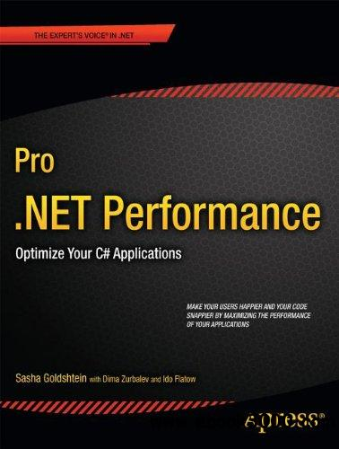

说起我目前的本职工作，主要是负责应用程序基础框架的编写，每天想着就是如何做性能优化，如何让代码更清晰，如何让排错变得容易等等。这些技术活其实都挺好玩的，尤其是排错方面，有段时间我就在写一个简单的调试器，在生产环境中假如程序遭遇了死锁，它便会自动附加到进程上探究一番，然后打印一串数据，以便可以在事后找出问题。

所以我最近十分欣赏《Pro .NET Performance》这本书：

里面讲的东西简直太好用了，一边儿给我启发，一边儿与我产生共鸣。其实这应该算是第一本主动推荐国内出版社引进的书吧，可惜联系了两个出版社都好像不愿意搞，说是 .NET 的高级别书都不太好卖，还有说这书太老的。真是岂有此理，这可是 2012 年的书，要知道它的姐妹篇《Java Performance》可是 2011 年的书，不也出版了吗？

真想和他们绝交啊。

算了，假如哪个出版社打算引进的话，我亲自来翻译吧。我可是从来不写书，更不翻译的，这下够有诚意了吧？

“赵人希”不是打算用来自说自话的，虽然现在好像大多数情况下都是我在自说自话。其实大家在平时开发过程中也一定会遇到一些难题吧，比如内存泄露，性能不足等等。假如您觉得这个问题有价值，或者解决不了，就尽管丢给我吧。当然是否帮您深究不敢保证，但至少让我有一些额外的问题可以想想。我脑子不够好，需要开发点智力。

或者您写了一篇有价值的文章，想要分享给别人看，也不妨把链接发给我，有价值的文章我一定想办法帮您推广出去。文章不限技术类别，.NET，Java，JavaScript，Go等等，什么都行，我喜欢玩各种技术。比如我虽然讨厌 Java 语言，但对于 Java 平台还是很有好感的，最近也刚开始看《Java Performance》这本书，对于优化 .NET 程序其实也很有帮助，不信我下次举些例子给你们看。

最后说下封面：微软最近在 Code Conference 活动里演示了最新的语音识别及自动翻译技术，可以用来辅助聊天用，点击下方“阅读原文”可以访问演示视频。试想一下未来吧，假如您摇一摇的时候发现一些外国妹纸，比如这样的：

到时候您也不会担心没法沟通了，不是吗？多么美好的世界！