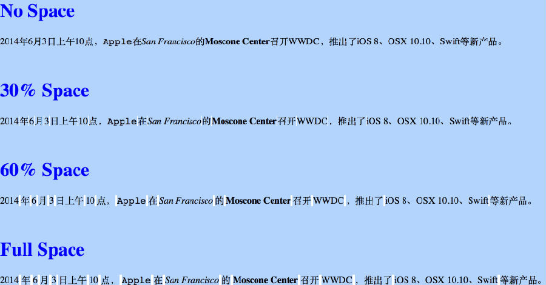

话说最近看到有人说，中文和英文混排的规范之一，是要在英文与中文之间添加空格。举个例子，就是说不该是“微软and苹果”而是应该“微软 and 苹果”。我看了看，似乎的确更舒服一些，于是就这么做了几天，其中还写了一两篇微信消息和文章。

不过慢慢我又觉得有点不爽了，因为加了空格以后有时候会让我觉得文字变得很松散，尤其是例如“2014 年 3 月 10 号”这种英文密度较高的唱歌，反而让我觉得读起来很累。于是我就问了很多人的看法，有人觉得应该加空格，也有人觉得不该，各有各的说法。点击下方“阅读原文”可以看到知乎上针对这个问题的讨论。

觉得应该加空格的人，是因为中文和英文之间太挤。专业的排版工具（例如Word、LaTex和InDesign）都会自动在英文和中文之间加上空白，但网页里没这个功能，所以得手动加上空格，虽然有些太宽，但这也是没办法里的办法。

觉得不该加空格的人，是因为空格本身不是内容的一部分。手动加上空格之后，中英文之间的间距太大，破坏了阅读的节奏。再者，假如把加了空格的文字复制到专业排版工具里，则反而会多出额外的空格。

看出来了么，这里其实并没有根本性的矛盾。大家其实都同意中英文之间留有空白，只不过就“是否加一个完整的空格”产生了不同意见。说起来双方都在让步，只不过让步的方向不同。那么有什么更好地办法吗？

当然有，我们是程序员啊。我最近就在尝试着“自动加空白”这么一件事情，封面就是暂时的成果。简单地说，就是使用JavaScript在需要的地方加上空白元素。效果在全选时更为明显，如图：

由于我只是在需要的地方加上一个span元素，至于它具体会占多少宽度，就可以由各位自行决定了。这么做的好处便是可以自由控制空白尺寸，且复制粘贴的内容不会受到影响。

当然，我还在进一步修改挑选空白位置的算法。HTML是嵌套结构，还分块状和内联元素，因此坑比我想象中要多。等搞完了以后，也会发出来给大家玩玩，大家也不妨自己尝试一下。