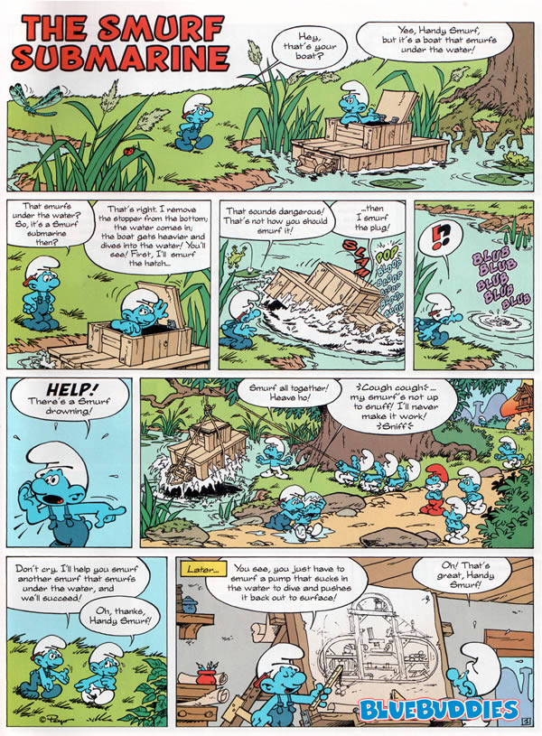
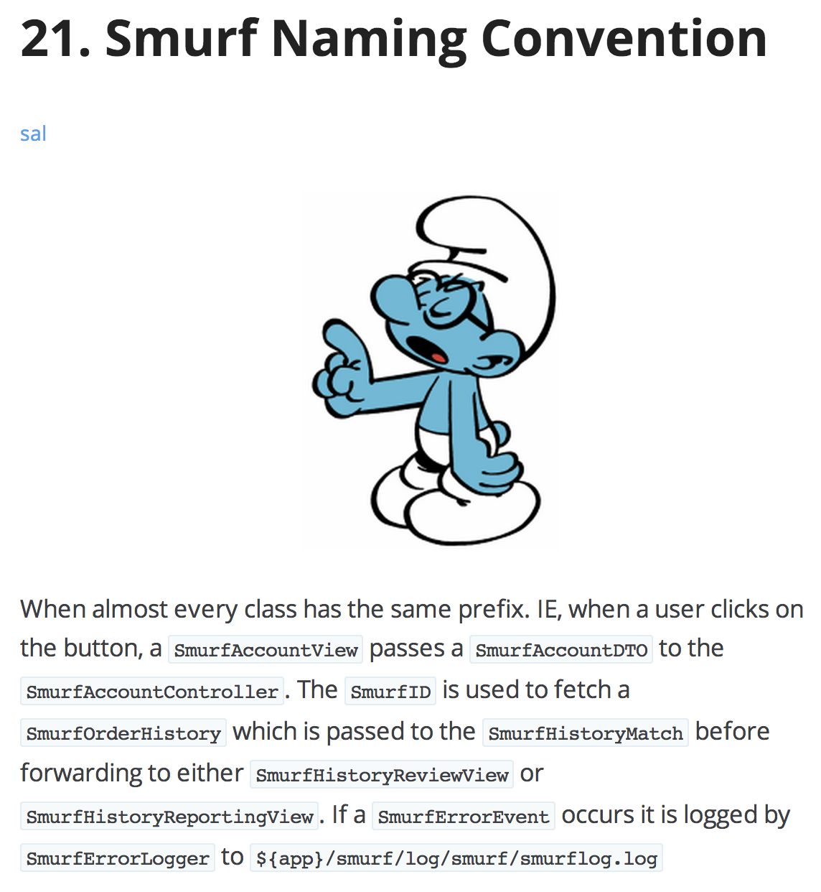
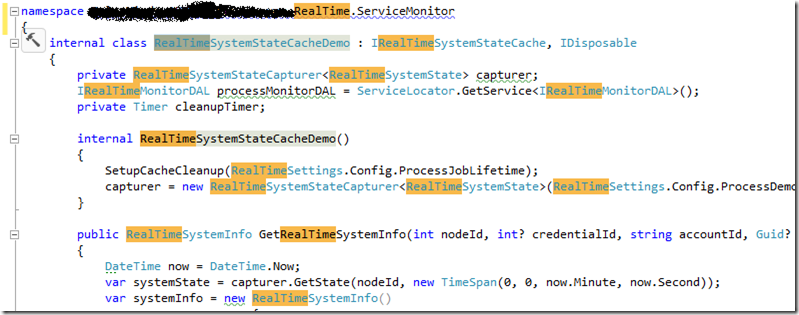

俗话说的好，软件开发其实只涉及到两个问题：缓存失效及命名。我也时不时为命名伤透脑筋。两天前在微博上随口提到一句“蓝精灵命名法”，应者无数，但绝大部分人都奔着“匈牙利命名法”而去了，着实令人蛋疼，那么现在就来介绍下所谓的“蓝精灵命名法”。

假如你足够老，就会听过“在那山滴那边海滴那边有一群蓝精灵”这首歌，可谓脍炙人口。其改编版从“一群草泥马”到“一群程序员”乃至“在那左腿右边右腿左边有一片黑森林”，彰显高贵风范。不过我们小时候看的都是配音版，所以往往不会注意到蓝精灵的说话特征，就是把“Smurf”这个单词作为助词使用，于是对话中往往Smurf不断，比如：

这种“蓝精灵命名法”，即“Smurf Naming Convention”是几年前在Jeff Atwood的博客上第一次看到的（点击下方“阅读原文”可访问这篇文章《New Programming Jargon》），其中是这样写的：

网上还能找到一些实际案例：

把一个模块下的各类型都加上相同前缀，往往是在缺少“命名空间”支持的语言中，用来应对类型重名问题的。不过现代的语言往往都直接带有“命名空间”或是“模块”的支持，所以一般来说，除非明显会造成很大困扰，我也越来越少使用这种命名规则了。

在不加模块前缀之后，一般会遇到困扰的情况都是，比如，需要在同一个地方使用两个模块的同名类型。在C#里，这时候就可以使用using关键字给类型取别名（Alias）。这里又要吐槽Java了，居然类似的功能，遇到这种问题只能为其中一个类型使用全名了。用过Java写过数据库访问代码的同学往往都会有所体会，因为`java.util.Date`和`java.sql.Date`这两个常用类型经常会撞车，苦不堪言。

之前我也提到过，Java缺少C#的“显式实现接口”能力，导致一个类型实现的两个接口中有相同签名的方法就瞎了。Java在各种细节上就是那么不考虑开发人员感受。