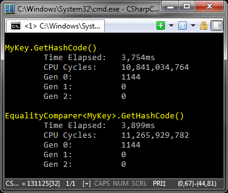

人懒 + 工作忙 = 一直没有更新“快速问答”栏目。今天终于可以更新了，还会新出一个问题，是我在工作中遇到的真实案例。

## 上期解答

上期的问题是关于自定义“值类型”（即`struct`）在作为字典的键时是不是需要做些什么特别的事情。就比如`MyKey`这样的定义：

```cs
public struct MyKey {
    public readonly int Value;

    public MyKey(int value) {
        Value = value;
    }
}
```

这样是不是就足够了？经过实际测试，可能你会发现这样的定义已经“可用”了，但“可用”并不代表正确。字典内部在使用键进行查找元素的时候，会用到键的`GetHashCode`和`Equals`方法。很多同学都能意识到默认的`Equals`方法会引起装箱，因为它的参数是一个`object`，这很明显——那么`GetHashCode`呢？似乎绝大部分同学以为没什么问题，但事实上其默认的实现是继承自`System.Enum`类型，调用时依旧会把`this`进行装箱，造成性能开销。

这里我们使用`CodeTimer`组件来进行简单的实现，例如下面的代码：

```cs
var key = new MyKey(10);
var comparer = EqualityComparer<MyKey>.Default;

CodeTimer.Time(
  "MyKey.GetHashCode()",
  100000000,
  () => key.GetHashCode());

CodeTimer.Time(
  "EqualityComparer<MyKey>.GetHashCode()",
  100000000,
  () => comparer.GetHashCode(key));
```

由于字典内部并非直接调用`GetHashCode`和`Equals`，而是通过`IEqualityComparer<T>`进行访问的，因此我在这里也对其进行了测试，结果如下：



看到没，这里发生了一千多次0代GC，充分证明了默认的`GetHashCode`调用会产生装箱。这里再次推荐`CodeTimer`类，这个我五年前在博客上公开的小组件，用它来进行简单地性能测试简直再方便不过了。它除了能够打印出最基本的“时间”之外，还会输出测试期间发生了几次垃圾回收。此外还有一些细节方面的考虑，例如它会把当前进程和当前线程的优先级设为最高，让结果尽量准确。

你是不是也很喜欢这样好用的小玩意儿？赶快点击“<span style="color:blue;">阅读原文</span>”吧！

避免装箱的解决方法有两个。首先，可以重载`GetHashCode`方法并实现相应的`IEquatable<T>`接口（例如`MyKey`需要实现`IEquatable<MyKey>`接口），这样`EqualityComparer<T>.Default`便会返回一个使用接口方法的`IEqualityComparer<T>`对象，其`Equals`及`GetHashCode`均不会产生装箱——请注意，重载`GetHashCode`必不可少，这样才能避免装箱。其次，也可以在使用字典时向构造函数传入一个自定义的`IEqualityComparer<T>`对象，提供合适的实现，只要不调用定义在`System.Enum`上的默认实现，同样可以避免装箱。

不过似乎同学们大都只提到了第一种实现`IEquatable<T>`接口方法，但第二种方法却没有提到。其实第二种做法更为灵活，因为可以为相同的对象使用不同的比较方法。我在面试时常问的基础问题之一，便是如何创建两个字典，它们均以字符串作为键的类型，但其中一个区分，另一个缺不区分大小写。其实答案很简单，传入不同的`IEqualityComparer<string>`对象即可，但绝大部分人却回答不出这个问题。

真是我见犹怜。

## 本期问题

本期的问题源自我在工作中遇到的一个真实案例。当然，我这里描述的是简化后的版本。

我们经常会遇到需要大量数据修改的场景，例如向一个集合中添加一万个对象，并对外通知改变。假如我们单个单个添加，每添加一个发起一次通知，这会造成较大的性能开销。于是我们常常会采用一个“缓冲”机制，积累一定数量的对象，再进行统一的提交，例如一万个对象分成三四批进行，这样只需要发起极少数的通知即可，这样性能会有很大提高。

我们将这样的机制简单抽象为`IBuffer`接口：

```cs
public interface IBuffer {
    void Flush();
}
```

每个实现了`IBuffer`接口的缓冲对象，都要能够在多线程环境下使用，例如一个简单的`AddBuffer`实现可以是这样的：

```cs
public class AddBuffer<T> : IBuffer {
    private readonly object _gate = new object();
    private List<T> _items;
    
    public void Add(T item) {
        lock (_gate) {
            if (_items == null) {
                _items = new List<T>();
            }
            
            _items.Add(item);
        }
    }
    
    public void Flush() {
        List<T> items;
        
        lock (_gate) {
            items = _items;
            _items = null;
        }
        
        if (items == null)
            return;
            
        // flush into collection
    }
}
```

为了简化问题，我们姑且规定`Flush`方法只会被顺序调用，但它与`Add`方法之间，或是`Add`方法自身都会被任意调用。在`Flush`方法中，我们在`lock`内部只进行简单地引用复制，因此它对`Add`方法的干扰很小，这也是我们希望的结果。如上的`AddBuffer`实现很简单，假如您还看不明白的话，我也懒得多做解释了，只是我建议您要努力学习，多看代码。

然后，我们假设有这样一个`Item`类型：

```cs
public class Item {
    public void First() { /* ... */ }
    public void Second() { /* ... */ }
}
```

而有这样两个`IBuffer`接口的实现：

```cs
public class FirstBuffer {
    // ...
    
    public void Flush() {
        // ...
        
        foreach (var item in items) {
            item.First();
        }
    }
}

public class SecondBuffer {
    // ...
    
    public void Flush() {
        // ...
        
        foreach (var item in items) {
            item.Second();
        }
    }
}
```

再加上这样的使用方式：

```cs
var firstBuffer = new FirstBuffer();
var secondBuffer = new SecondBuffer();

// Thread A
new Thread(() =>
{
  while (true)
  {
    var item = new Item();

    firstBuffer.Add(item);
    secondBuffer.Add(item);

    Thread.Sleep(1);
  }
}).Start();

// Thread B
new Thread(() =>
{
  while (true)
  {
    firstBuffer.Flush();
    secondBuffer.Flush();

    Thread.Sleep(100);
  }
}).Start();
```

我们假设`Item`类的两个方法是有依赖的，也就是说，它的`First`方法**必须**于`Second`方法之前调用。为了保证这一点，在上面的代码中，我们在线程A中将`item`对象先放入`firstBuffer`，再放入`secondBuffer`。而在线程B中，我们先提交`firstBuffer`，再提交`secondBuffer`。通过这种方式，我们希望可以建立起两个缓冲对象之间的依赖关系，确保所有的`Item`对象的两个方法都能按照我们希望的顺序进行调用。

但是，通过上面的代码，我们的目标得以准确实现了吗？

假如上面的实现有错，那么问题出在什么地方？应该如何修复？请将您的做法贴在<span style="color:blue;">gist.github.com</span>中，并将链接发送给我。这里我不指定任何“方向”，您可以改造两个缓冲类的实现，甚至对`IBuffer`接口进行一些改变，只要您的做法可以满足上述目标。此外，还希望可以尽可能地简单。当然最重要的是，不要只给我看一些所谓“设计思路”，一定要把可以直接运行的代码发给我。假如您觉得实现起来太复杂，那么可能也就意味着您的解决方法不够理想。

对了，<span style="color:red;">用Java的同学们这次也可以来一试哟</span>。

注：本期的封面是TPL Dataflow中的`BufferBlock`组件示意图。TPL Dataflow可谓神器，在日常开发过程中给予了我很大帮助。