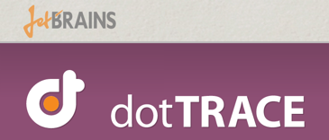
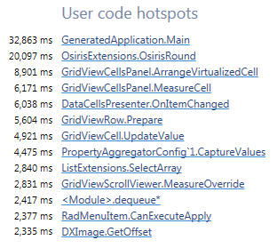
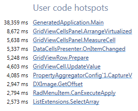

上一篇里提到说，我改掉了项目中一行神奇的代码，于是性能得到了很大提升。于是有好几个同学问我如何可以发现程序中的性能瓶颈……呃，你们难道平时都不用Profiler吗？

所谓“检测”，英文叫做Profiling，用来做Profiling的工具自然叫做Profiler。检测性能问题有Performance Profiler，检测内存问题则有Memory Profiler。每个成熟的技术平台都有大量成熟的Profiler，尤其是商业产品，没有人会放弃这块市场。反过来说，假如这个平台没有好用的Profiler，那几乎可以认为它还不够成熟，还不够用来做认真的项目。

当然Profiler之间是有高下的。对于此类专业工具来说，商业Profiler几乎总是比免费的要强大的多，而商业产品之间也会有很大差距。例如，.NET方面我之前最常用的是Yourkit家的.NET Profiler：

现在想了想，用它得原因大概是因为老板是Java背景吧。Yourkit Java Profiler似乎做的很不错，但他家的.NET Profiler就实在让人难以恭维了。总体而言，界面是不错，但一旦开始Profiling，那程序一下子就变得奇慢。

对于一个Profiler来说，给程序带来负担（overhead）是难以避免的。一般来说，Profiler都会提供多种探测方式，例如采样（Sampling）或是追踪（Tracing）。“采样”一般都是定时打点，看看程序每个线程当前落在哪个方法里，当前的调用堆栈是什么，以此发现程序热点，“追踪”则往往会记录方法进入和退出的时间，所以显然前者的负担要小过后者。

一般来说，负担越大的探测方式，获得的结果越为准确，但负担本身不属于程序本身，因此负担越大，往往越难体现程序真正的性能问题，这中间是个权衡。不过好玩的是，Yourkit Profiler的“采样”负担就比JetBrains dotTrace的“追踪”还要来的高，而Yourkit Profiler的“追踪”几乎就让我的程序慢的无法使用了，而dotTrace的“采样”似乎不会让程序慢多少。

这就是技术上的差距。

有了Profiler，发现性能瓶颈绝对事半功倍，例如dotTrace直接列出了程序热点：

看到那个`OsirisRound`方法了吗，点进去以后谁都能发现了问题所在，修复自然也轻而易举。改进之后，这个方法直接从热点列表里消失了。事实上，由于这个方法过于基础，这个改进让列表中的每个方法都快了不少（看与Main方法的比例）：

其实为了提高开发效率，大家都会提供各种各样的工具来辅助各种各样的工作。Profiler只是其中一块而已，还有比如调试器等等，都是提升工作效率的利器，例如VS中可以显示并行任务之间的依赖关系，这种都可以帮助程序员从大局考虑性能优化，根本不是各种命令行DBG可以代替的。

对于专业人士来说，善用工具不是最基本的吗？

对了，IDE也是一大类工具。别跟我说VIM或者Emacs什么，它们早就和IDE是一回事情了。你以为配置那么多插件和扩展，把整个界面改的花枝招展，还要代码提示等功能，这都在干什么的呢？不就是在把它们打造成IDE吗？现代IDE也早就不是鼠标点点点样的傻瓜工具了，它可是专业工具，几百上千个快捷键不是装饰品。现在我看到有人在VIM/Emacs和IDE中吵哪个才是“王道”就觉得好烦——你们早就融合了好吗？我还在VS里用VIM输入方式呢。

真要争论的话，VIM还是Emacs倒还好一战，毕竟输入方式是不同的。

最后再推荐一个工具：JetBrains出品的dotPeek：

点击下方“阅读原文”可以看到它的介绍。它是一个和.NET Reflector类似的反编译工具，功能也比较类似，例如可以调试没有源代码的程序集等等，其原理是自动把程序集反编译为代码，生成pdb文件，并架设一个Symbol Server，以便从VS中Step In进去。目前dotPeek还是一款免费工具，但不知道以后是否会和.NET Reflector一样开始收费。

不过收费了又怎样，对于程序员来说时间才是最值钱的。跟程序员的工资，跟程序的质量，跟公司随时间流逝的机会成本相比，这些开发工具的授权费用都算个蛋蛋哪！同理，程序员就该用最好的机器，SSD起步，16G内存起步，多屏幕也是必须的，否则代码都写得伐开心，每天就想着去买包包。

当然我也知道，总有一些不明白这些道理的程序员，还有雇主。

希望你不是这样的人。

（这次的封面是我的办公桌，大家也可以把自己的办公桌发给我看看哟。）